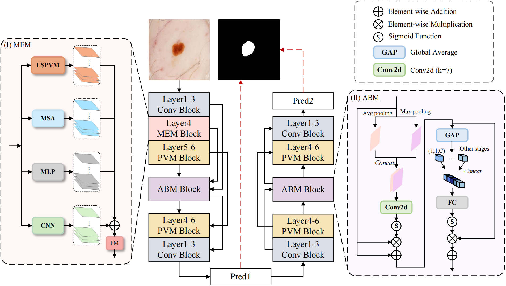

# DUMFNet

This is the official code repository for "DUMFNet: Enhanced Medical Image Segmentation with Multi-visual Encoding and Local Scanning".




## 0. Main Environments

The environment installation procedure can be followed by [UltraLight-VM-UNet](https://github.com/wurenkai/UltraLight-VM-UNet), or by following the steps below (python=3.8):

```
conda create -n DUMFNet python=3.8
conda activate DUMFNet
pip install torch==1.13.0 torchvision==0.14.0 torchaudio==0.13.0 --extra-index-url https://download.pytorch.org/whl/cu117
pip install packaging
pip install timm==0.4.12
pip install pytest chardet yacs termcolor
pip install submitit tensorboardX
pip install triton==2.0.0
pip install causal_conv1d==1.0.0  # causal_conv1d-1.0.0+cu118torch1.13cxx11abiFALSE-cp38-cp38-linux_x86_64.whl
pip install mamba_ssm==1.0.1  # mmamba_ssm-1.0.1+cu118torch1.13cxx11abiFALSE-cp38-cp38-linux_x86_64.whl
pip install scikit-learn matplotlib thop h5py SimpleITK scikit-image medpy yacs
```


## 1.Datasets

You can refer to [UltraLight-VM-UNet's](https://github.com/wurenkai/UltraLight-VM-UNet) approach to processing datasets, or download the .npy files of these datasets from this [link](https://drive.google.com/drive/folders/1aNuwMmOJq8X8gCKOjy6gDar1G5PieoXi), and then organize the .npy files into the following format:

'./datasets/'

- ISIC2017
  - data_train.npy
  - data_val.npy
  - data_test.npy
  - mask_train.npy
  - mask_val.npy
  - mask_test.npy
- ISIC2018
  - data_train.npy
  - data_val.npy
  - data_test.npy
  - mask_train.npy
  - mask_val.npy
  - mask_test.npy
- PH2
  - data_train.npy
  - data_val.npy
  - data_test.npy
  - mask_train.npy
  - mask_val.npy
  - mask_test.npy


## 2. Train the DUMFNet

```
python train.py
```


## 3. Test the DUMFNet 

First, in the test.py file, you should change the address of the checkpoint in 'resume_model'.

```
python test.py
```


## 4.Acknowledgement

Thanks to [Vim](https://github.com/hustvl/Vim), [VM-UNet](https://github.com/JCruan519/VM-UNet) and [UltraLight-VM-UNet](https://github.com/wurenkai/UltraLight-VM-UNet) for their outstanding work.
