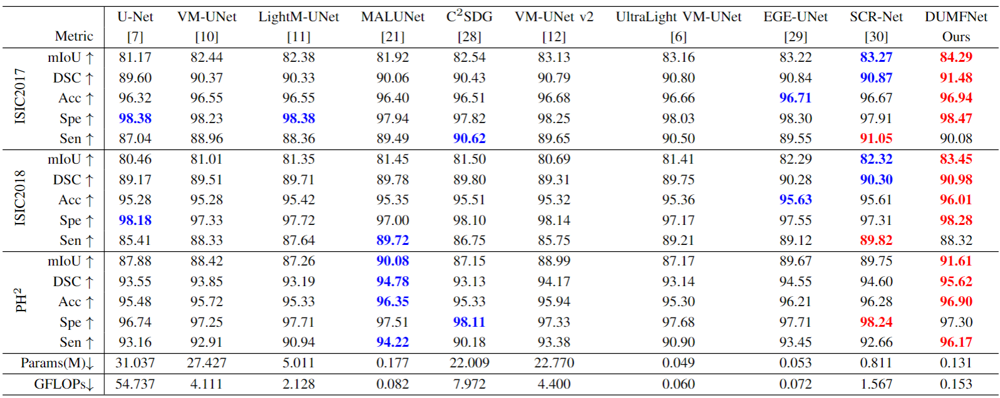

# DUMFNet

## 0. Abstract

With the Mamba framework is widely applied, the state-space model has yielded outstanding results in the field of computer vision. Nevertheless, the superiority of the model to its counterparts, namely, CNN-based or Transformer-based models, is limited, because it faces large challenges in local region feature extraction resulting from the deficient positional awareness and the disproportional emphasis on posterior tokens in its pre-defined scanning schedules. Besides, a majority of the current Mamba-based models usually fail to take into account the advantages of the integration of multi-visual encoding strategies. Against this background, we propose a novel DoubleU-Net framework with multiple visual encoding strategies and a local-based scanning mechanism. The comparative \& ablation experiments with the current SOTA methods verifies the superiority or competitiveness of the DUMFNet.


## 1. Overview

<div align="center">

</div>


## 2. Main Environments

The environment installation process can be carried out as follows:

```
conda create -n DUMFNet python=3.8
conda activate DUMFNet
pip install torch==1.13.0 torchvision==0.14.0 torchaudio==0.13.0 
pip install packaging
pip install timm==0.4.12
pip install pytest chardet yacs termcolor
pip install submitit tensorboardX
pip install triton==2.0.0
pip install causal_conv1d==1.0.0  
pip install mamba_ssm==1.0.1
pip install scikit-learn matplotlib thop h5py SimpleITK scikit-image medpy yacs
```


## 3. Datasets

For the ISIC2017 and ISIC2018 datasets, you can refer to [UltraLight-VM-UNet's](https://github.com/wurenkai/UltraLight-VM-UNet) method for segmentation. For the PH2 dataset, please run the Prepare_PH2.py we provide to segment the training set, validation set, and test set. Then organize the .npy file into the following format:

'./datasets/'

- ISIC2017
  - data_train.npy
  - data_val.npy
  - data_test.npy
  - mask_train.npy
  - mask_val.npy
  - mask_test.npy
- ISIC2018
  - data_train.npy
  - data_val.npy
  - data_test.npy
  - mask_train.npy
  - mask_val.npy
  - mask_test.npy
- PH2
  - data_train.npy
  - data_val.npy
  - data_test.npy
  - mask_train.npy
  - mask_val.npy
  - mask_test.npy


## 4. Train the DUMFNet

```
python train.py
```


## 5. Test the DUMFNet 

First, in the test.py file, you should change the address of the checkpoint in 'resume_model'.

```
python test.py
```


## 6. Comparison With State of the Arts

Performance comparison of the proposed method against the SOTA approaches on ISIC2017, ISIC2018 and $\text{PH}^2$, where the best two results are represented in red and blue, respectively.

<div align="center">

</div>


## 7. Acknowledgement

Thanks to [Vim](https://github.com/hustvl/Vim), [VM-UNet](https://github.com/JCruan519/VM-UNet) and [UltraLight-VM-UNet](https://github.com/wurenkai/UltraLight-VM-UNet) for their outstanding works.
